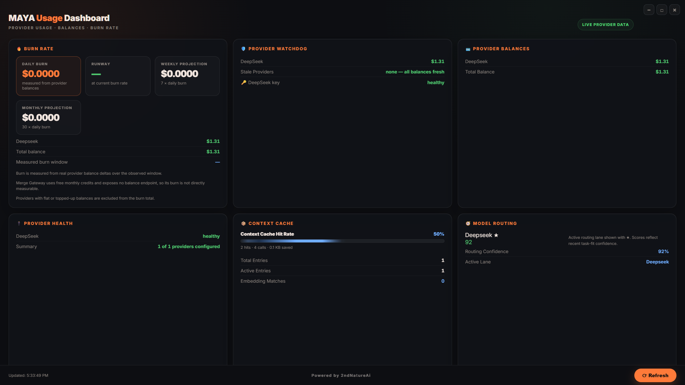

# MAYA Usage Dashboard

**See where your AI budget actually goes.**

MAYA Usage Dashboard turns raw provider balances into a live picture of burn rate, runway, and key health. Point it at any provider that exposes a balance endpoint and it measures dollars-per-day from real balance deltas, watches for stale or rejected keys, and renders everything on a single dark dashboard with zero dependencies.

**Real numbers, not estimates. Your providers, not ours.**

MAYA Usage Dashboard is a local, public-beta, provider-agnostic monitoring surface for AI provider spend. It probes the provider keys in your environment, records balance points to a local history file, and self-populates burn rate over time. No cloud, no account, no telemetry.

> MAYA Usage Dashboard is a controlled public beta. All data stays local to the machine that runs it. It is not a hosted service and carries no production SLA.



*Shown with a configured provider setup. First run shows $0.00 with no providers — the dashboard populates from the provider keys in your environment and self-builds burn rate over a few hours.*

## What it does

- **Burn rate from real deltas**, it measures dollars-per-day from actual balance movements, not estimates
- **Runway and projections**, how long the current balance lasts at current burn, plus weekly and monthly views
- **Provider watchdog**, probes every configured provider, flags stale histories and misconfigured keys
- **Dead-key detection**, a rejected key (401/403) is flagged the moment it happens, with rotation reminders
- **Provider-agnostic**, works with whatever balance endpoints you configure, nothing is hardcoded to one vendor
- **Zero dependencies**, Node's built-in runtime and test runner, no npm install required
- **Public-safe by construction**, the served payload carries provider health and balances only, no internal state

## Quick start

Requirements: Node.js 22 or newer.

```bash
npm test
npm start
```

Open `http://127.0.0.1:8765/`.

No dependency installation is required. The package uses Node's built-in runtime and test runner.

## How burn rate works

Burn rate is measured from real provider balance deltas over time. The server keeps a `maya-agent/state/balance-history.jsonl` file (one JSON line per balance sample) and computes dollars-per-day from the difference between samples.

- First run with no history: burn shows `$0.00` and runway shows `—`. This is expected.
- The server self-populates: every time the burn-rate endpoint is called (the dashboard auto-refreshes every 60s), it records the current balance for each configured provider, throttled to one point per hour. After a few hours you have real samples and the burn rate appears automatically.
- Override the history file location with the `MAYA_BALANCE_HISTORY_PATH` environment variable.
- Providers without a programmatic balance endpoint are excluded from the burn total and shown honestly as not-measurable.

## Provider-specific wiring

The dashboard is provider-agnostic by default, but the balance self-population needs a reference provider. The bundled probes cover DeepSeek, OpenAI, and Anthropic, each activated by its own environment key:

```dotenv
DEEPSEEK_API_KEY=«your key»
OPENAI_API_KEY=«your key»
ANTHROPIC_API_KEY=«your key»
```

Each probe only runs when its key is present, so the watchdog adapts to whatever you configured.

To add your own provider, add an entry to `BALANCE_PROBES` in `lib/mayaProviderProbe.js`. It just needs `id`, `envKey`, `label`, and an `async probe(apiKey)` returning `{ ok, balance }`.

### Handing this to any AI agent

If you want an AI assistant to wire the dashboard up for a new provider, paste this prompt into your assistant:

````text
MAYA Usage Dashboard provider wiring. In the repo you are in:

1. Confirm `public/usage-dashboard-public.html` exists and the server routes
   `/api/maya-agent/burn-rate` and `/api/maya-agent/realtime-usage` are
   registered in `server.mjs`.
2. Confirm `lib/mayaBurnRate.js` exports `buildBurnRate`,
   `resolveBalanceHistoryPath`, and `recordBalancePoint`, and
   `lib/mayaProviderProbe.js` exports `runWatchdogTick`.
3. Find `BALANCE_PROBES` in `lib/mayaProviderProbe.js`. Each probe is
   `{ id, envKey, label, rotationDays, refresh, async probe(apiKey) }`.
   The `probe` must return `{ ok, balance }` (balance in dollars, or null
   when the endpoint exists but exposes no balance).
4. Add your provider's entry, then set its `envKey` in the environment.
5. Start the server and call the burn-rate endpoint:
   `curl http://127.0.0.1:8765/api/maya-agent/burn-rate`
   Expected: `ok: true`, the new provider appears in `providers`, and after
   at least one recorded point `selfPopulated.recorded` includes it.
6. In `public/usage-dashboard-public.html`, the `PUBLIC_PROVIDER_LABELS`
   map controls display names. Add your provider id there (e.g.
   `'anthropic': 'Anthropic'`). Unknown ids already fall back to a
   prettified version, so this step is cosmetic but recommended.
7. Report which provider you wired in, the exact lines you changed, and the
   resulting burn-rate response.
````

## Standalone watchdog

The dashboard ships with a standalone watchdog script for users who want the watchdog to run even when the server is down. Wire it with your platform's scheduler (Windows Task Scheduler, cron, systemd timer, or your agent platform's scheduled jobs):

```bash
node tools/maya-usage-watchdog.mjs            # one tick, compact report
node tools/maya-usage-watchdog.mjs --json     # machine-readable report
node tools/maya-usage-watchdog.mjs --quiet    # only print problems
```

Exit code `2` means stale or failing providers were detected.

## Key health, rotation and dead-key detection

The watchdog watches your keys, not just your balances, so the things that silently break setups get caught early:

- **Key health states**, every configured provider gets one of `healthy`, `connected`, `unreachable`, or `auth_failed`. A rejected key (401/403) is flagged as `auth_failed` immediately.
- **Dead-key alerting**, when a key is rejected, the watchdog marks it in the dashboard (`Provider Watchdog` card) and the standalone script exits with code `2`.
- **Rotation reminders**, static API keys should be rotated periodically. The watchdog tracks how long each key has been in use and flags `rotation due` after 90 days (configure per-provider with the `rotationDays` field).
- **Honest about refresh**, static keys have no public rotate API, so the watchdog cannot silently swap them. What it can do is tell you the moment one dies.

## Security and privacy

- **Keys are never stored or logged.** Provider keys are read from environment variables in-memory only. The balance history file stores provider, balance, and timestamp, never key material.
- **No telemetry.** The only outbound traffic is the provider balance endpoint call itself.
- **Loopback by default.** The server binds to `127.0.0.1`; do not expose it to the internet.
- **Public-safe API.** The `/api/maya-agent/realtime-usage` endpoint returns provider health and balances only. No internal state, memory usage, or configuration is exposed.

## Verification

```bash
npm test
```

Runs the full test suite with Node's built-in test runner. Tests cover burn-rate math, watchdog probes and key health, and the live server contract (dashboard serving, public-safe payload, burn-rate shape, 404 handling).

## License

MAYA Usage Dashboard is distributed under the 2ndNatureAi Public Beta Evaluation License 1.0. See [LICENSE.txt](LICENSE.txt) for the full terms.

## Support & reporting issues

Every MAYA product is a public beta. Expect rough edges and rapid iteration.

Found a bug or a sharp edge? Open an issue on this repository. For anything sensitive, use GitHub's **Private vulnerability reporting** (see [SECURITY.md](SECURITY.md)). Never put credentials or private data in a public issue.

If you want your own AI agent to investigate before you report, paste this into it:

````text
Investigate a bug report for the MAYA Usage Dashboard repository. Reproduce
the issue locally if you can, then draft a bug report with: a concise
summary, steps to reproduce, expected behavior, actual behavior, environment
details (OS, Node version), and any relevant logs. Redact all credentials,
API keys, and personal data before showing me the draft. Do not post
anything anywhere without my explicit approval.
````

## Project status

- **Public beta.** Controlled evaluation release. Local, no hosted service.
- **Audited.** Public surfaces are swept for secrets, personal data, and internal vocabulary before each release.